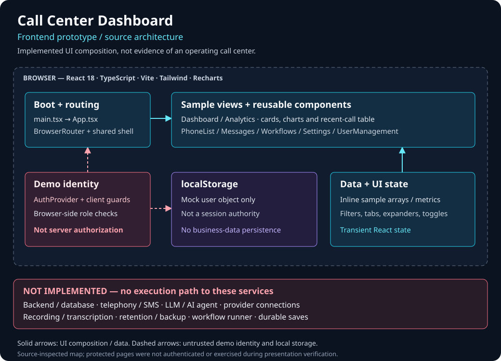

# Call Center Dashboard — Frontend Prototype

A React and TypeScript interface for exploring call-center layouts, sample analytics, searchable directories and workflow views. **This is a simulated dashboard, not an operating AI or telephony system.** Do not enter real credentials, contacts or customer data.

## What is implemented?

| Implemented in the frontend | Simulated or not implemented |
| --- | --- |
| Shared layout, React Router pages and client-side demo roles | No server authentication or authorization; browser state is not a security boundary |
| Directory search, tag/status filters and expandable message/workflow views | Sample contacts, scripts and workflows; no calling, delivery or workflow execution |
| Recharts charts, metric cards and recent-call table | All volumes, outcomes, percentages and statuses are illustrative, not operational results |
| Settings tabs, sliders, toggles and local form state | No provider connections, settings save, recording, transcription, retention enforcement or business-data persistence |

The mock user object is stored in browser localStorage. CRUD, import/export and several action controls are visual placeholders. Protected-view capabilities above are source-inspected, not an authenticated end-to-end verification.

## Architecture



React 18 · TypeScript · Vite · Tailwind CSS · Recharts · Lucide. [Source map and trust boundaries](docs/engineering.md).

## Run locally

Use Node.js 22 and npm; verification used Node 22.23.3 / npm 10.9.9 with the existing lockfile.

```sh
npm ci --ignore-scripts --no-audit --no-fund
npm run dev -- --host 127.0.0.1
```

No provider keys or backend are required. Keep the development server on loopback and use disposable browser state. See [local development](docs/local-development.md) for production preview and checks.

```sh
node --test scripts/test-presentation.mjs
npm run build
npm run lint
npx --no-install tsc --noEmit -p tsconfig.app.json
```

## Evidence and limits

- Presentation-copy checks pass; production build passes. Fresh signed-out desktop/mobile checks cover the local candidate, not dashboard operation.
- **Existing failures remain:** lint (4 errors, 1 warning) and app typecheck (2 unused-import errors). Vite build does not typecheck.
- No behavioral test suite or CI workflow exists. The dependency-free presentation test checks source wording only.
- The [existing public root](https://ai-call-center-tau.vercel.app/) renders the older signed-out prototype. Direct `/login`, `/dashboard`, `/analytics` requests and `/vite.svg` returned 404 during inspection. This refresh does not repair routing, change hosting or assert that the new presentation is deployed.
- Dependency advisories, illustrative permission-table mismatches and accessibility gaps remain. No production-readiness or privacy-enforcement claim is made. [Verification scope and known risks](docs/evidence.md).

## Repository identity

The repository is [`SourceSenseiTheRealOne/call-center-dashboard`](https://github.com/SourceSenseiTheRealOne/call-center-dashboard), originally published as `AI_Call_Center`. The legacy package identifier and existing Vercel hostname intentionally remain unchanged.

No repository-wide license grant has been added. Public visibility alone does not grant reuse rights.
